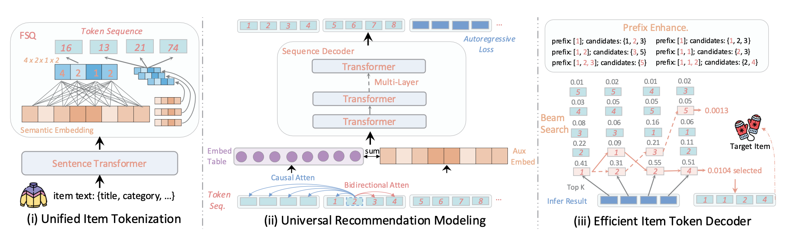
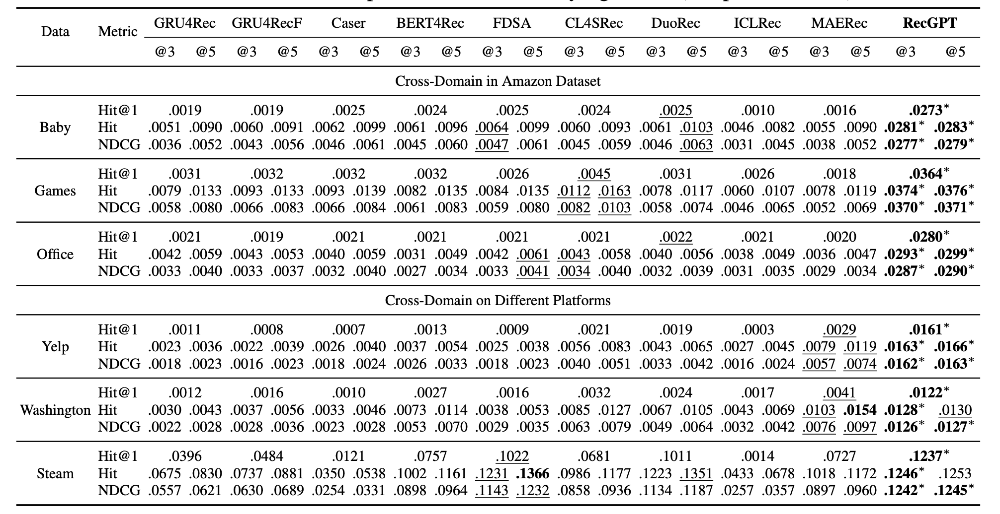
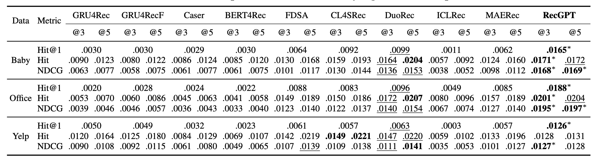
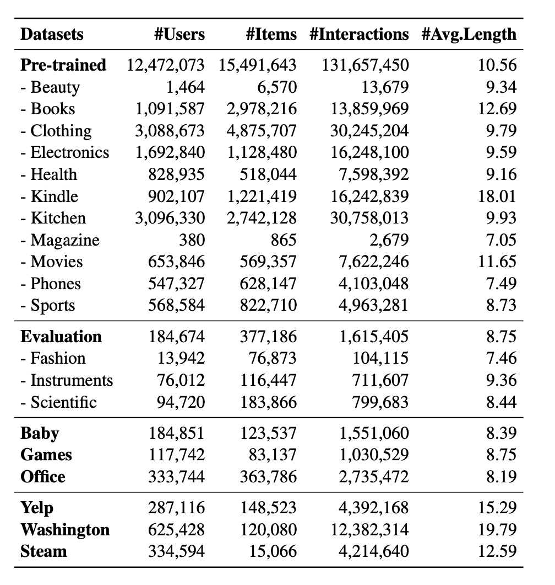

# RecGPT: A Foundation Model for Sequential Recommendation

This is the codes and dataset for RecGPT proposed in the paper **RecGPT: A Foundation Model for Sequential Recommendation**.


### Introduction

This work introduces a foundation model for recommendation systems aimed at enhancing generaliation. The proposed RecGPT model features a novel vector quantization-based item tokenizer that creats generalized token representations, effectively capturing diverse semantic features for context-aware recommendations. Additionally, the authors utilize a decoder-only transformer architecture with an autoregressive modeling paradigm that incorporates bidirectional attention, allowing the model to understand item token relationships and complex user behaviors across diverse scenarios. The authors evaluate RecGPT across several public datasets, targeting zero-shot and cold-start scenarios, and find significant improvements in generalization over existing methods.



## 📝 Environment

We develop our codes in the following environment:

- python==3.10

- numpy=1.23.4

- pandas=1.5.3

- scipy=1.9.3

- sentence-transformers=2.2.2

- torch=2.1.0

- transformers=4.34.1

- accelerate=0.28.0

- sentencepiece=0.2.0

- datasets=2.20.0
## 🚀 How to run the codes

**1. Pre-training**

(Note that for the pre-training of RecGPT, it is advisable to have multiple professional GPUs, such as A100 40G)

Before starting, please download the relevant pre-processed data from our Hugging Face repository (https://huggingface.co/hkuds) to ensure that the data in the ./data/pre_train/ directory is complete. 

To facilitate the pre-training process, we have prepared a script file, run.sh, to initiate the task:

```
bash ./run.sh
```

Alternatively, you can choose to run the following command directly:

```
accelerate launch pre_train.py --batch_size 40 --epoch 5 --tf_layer 3
```

You can adjust the batch_size according to your GPU capacity.

**2. Evaluation**

The goal of evaluation is to select the model weights from the numerous checkpoints saved during the pre-training phase that have the lowest loss on the evaluation set. 

Before starting, please download the relevant pre-processed data from our Hugging Face repository (https://huggingface.co/hkuds) to ensure that the data in the ./data/eval/ directory is complete. In addition, we have provided sub-files of the optimal weight files in the ./ckpt/ directory. You can either merge them or directly download the complete weight file from the Hugging Face repository.

To calculate the model's loss on the evaluation set, please use the following command:

```
python eval.py --tf_layer 3 --test_batch_size 96 --ckpt_path ./ckpt/recgpt_layer_3_weight.pt
```

You can adjust the test_batch_size and ckpt_path according to your actual situation.

**3. Prediction**

(Note that if you only want to use RecGPT for evaluating downstream recommendation datasets, you do not need to install the accelerate library.)

The model weights obtained after pre-training can be directly used for cross-domain zero-shot recommendation or cold start testing on downstream recommendation datasets. 

Before starting, please download the relevant pre-processed data from our Hugging Face repository (https://huggingface.co/hkuds) to ensure that the data in the ./data/test/ directory is complete.

For example, to test cross-domain zero-shot recommendation on the Steam dataset (which is already available in the GitHub repository and does not need to be downloaded from Hugging Face), please use the following command:

```
python predict.py --tf_layer 3 --test_batch_size 48 --dataset steam --ckpt_path ./ckpt/recgpt_layer_3_weight.pt
```

To test the cold-start task on the Steam dataset, please use the following command:

```
python predict.py --tf_layer 3 --test_batch_size 48 --dataset steam --ckpt_path ./ckpt/recgpt_layer_3_weight.pt --cold True
```

## 🎯 Experimental Results

**1. Zero-shot performance of RecGPT v.s. Few-shot performance of baseline methods:**



**2. Cold-start performance comparison of different recommendation models:**



## 📚 Datasets

**Statistics of the experimental datasets:**



Including 11 datasets for pre-training, 3 datasets for evaluation, and 6 datasets from diferent platforms for testing.

### Data Processing

We also provide some code and scripts for processing the datasets in the directory ./data_processing.

- TextEncoder_batch.py is used to encode the textual information of items using MPNet to obtain semantic embeddings.
- data_download.py is used to download the Amazon Review dataset.
- data_process_1.py is used to process the raw Amazon Review dataset into train.pkl and test.pkl, and it saves the textual information of items as item_text_dict.pkl.
- data_process_2.py is used to merge multiple datasets required for pre-training into a single train.pkl, and it generates several mapping files that index items from the individual datasets to the merged dataset.
- make_token_list.py is used to call the FSQ tokenizer to convert item semantic embeddings into token sequences.
- pre_train_data_process.py is used to merge the semantic embeddings of items from multiple datasets required for pre-training into a single file, based on the previously obtained mapping files.

## 👉 Code Structure

```
.
├── README.md
├── ae_trainer.py
├── ckpt
│   ├── layer_3_epoch_0_model_06.pt.zip.partaa
│   ├── layer_3_epoch_0_model_06.pt.zip.partab
│   ├── layer_3_epoch_0_model_06.pt.zip.partac
│   └── layer_3_epoch_0_model_06.pt.zip.partad
├── data
│   ├── eval
│   ├── pre_train
│   └── test
│       └── steam
│           ├── cold_test.pkl
│           ├── cold_train.pkl
│           ├── item_text_dict.pkl
│           ├── item_text_embeddings.npy
│           ├── test.pkl
│           └── train.pkl
├── data_processing
│   ├── TextEncoder_batch.py
│   ├── data_download.py
│   ├── data_process_1.py
│   ├── data_process_2.py
│   ├── make_token_list.py
│   └── pre_train_data_process.py
├── decoder.py
├── encoder.py
├── eval.py
├── figures
│   ├── cold-start.png
│   ├── dataset.png
│   ├── model.png
│   └── zero-shot.png
├── logs
├── model.py
├── model_train.py
├── modeling_gpt2_rec.py
├── pre_train.py
├── predict.py
├── run.sh
├── tree.txt
├── utils
│   ├── TimeLogger.py
│   ├── Trie.py
│   ├── data.py
│   ├── fsq.py
│   ├── past_key_values.py
│   └── util.py
└── vae_ckpt
    └── vae_len4_fsq88865_ep90.pt
```

## 🌟 Citation

If you find this work helpful to your research, please kindly consider citing our paper.